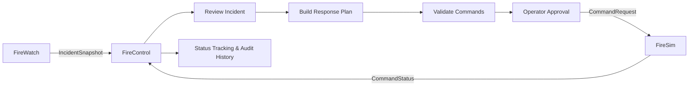
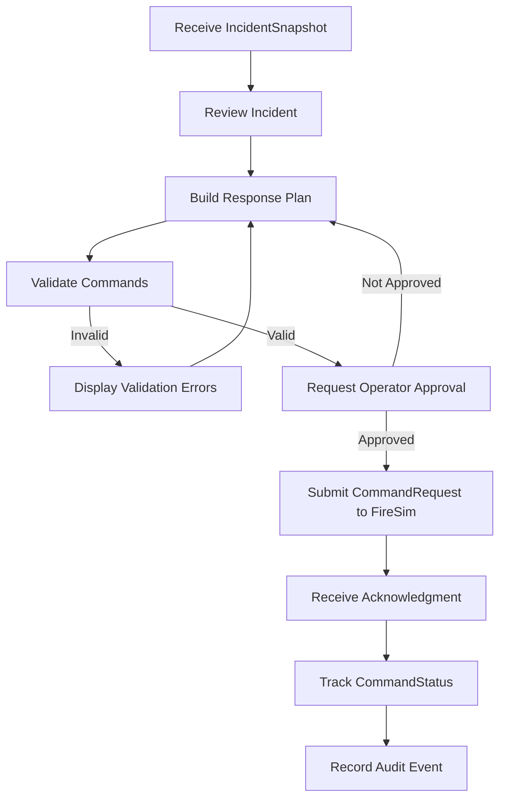
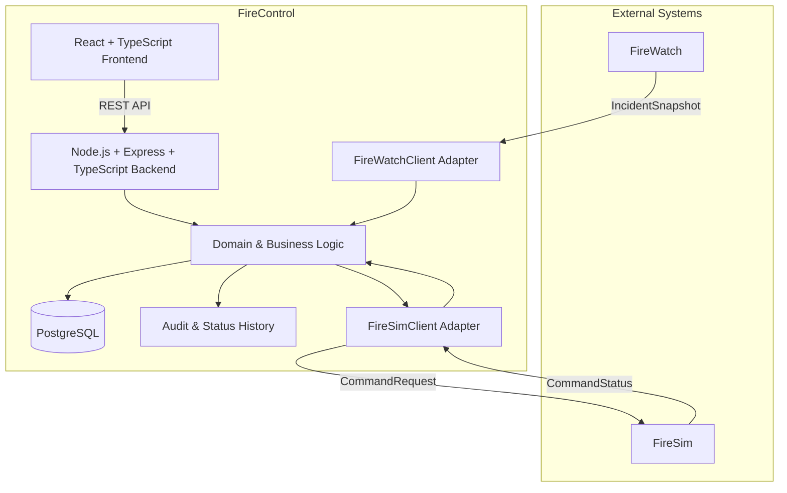
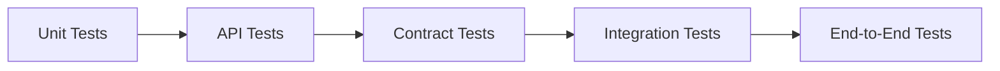
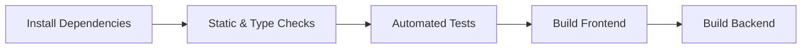

# FireControl

> **Wildfire Response Planning & Command Orchestration**

FireControl is a web-based command-orchestration platform developed for **CSYE 7230**.

It operates between **FireWatch** and **FireSim**, transforming wildfire incident information into validated, human-approved response commands while preserving execution status and audit history.

---

## Overview

Wildfire-response ecosystems can separate incident-state information from response planning and command execution.

**FireControl bridges that gap.**

The application enables an authorized operator to:

- consume the latest incident state from **FireWatch**
- review current wildfire conditions
- construct a structured response plan
- validate planned commands
- explicitly approve the plan
- submit approved commands to **FireSim**
- track acknowledgments and execution status
- preserve an auditable history of important events

FireControl is intentionally designed as an **orchestration layer**, not as a wildfire-detection, prediction, or simulation platform.

---

## System Context



### Component Responsibilities

| Component | Responsibility | Interface |
|---|---|---|
| **FireWatch** | Provides the latest wildfire incident state | `IncidentSnapshot` |
| **FireControl** | Reviews incidents, builds and validates plans, manages approval, submits commands, and tracks status | Web Application |
| **FireSim** | Simulates or executes approved response commands | `CommandRequest` / `CommandStatus` |

---

## System Boundary

### FireControl Responsibilities

FireControl is responsible for:

- incident-state intake
- incident review
- response-plan construction
- command validation
- explicit operator approval
- FireSim command submission
- acknowledgment handling
- command-status tracking
- retry handling
- audit-history preservation

### Out of Scope

The following capabilities are intentionally outside the FireControl MVP:

- wildfire detection
- fire-spread prediction
- digital-twin ownership
- autonomous strategy generation
- optimization engines
- real emergency dispatch
- live IoT ingestion
- public emergency alerts
- production safety certification

---

## MVP Features

### Incident Snapshot Intake

- retrieve the latest active `IncidentSnapshot`
- display incident zones
- display severity
- display weather conditions
- display available resources
- identify invalid or unavailable incident data

### Response Plan Builder

- create a response plan for the active incident
- add predefined response actions
- select target zones
- assign resources
- assign command priorities
- edit and remove planned commands

### Validation & Approval

- validate required command fields
- display clear validation errors
- prevent incomplete commands from being submitted
- require explicit operator approval before submission

### FireSim Integration

- submit approved `CommandRequest` objects
- process accepted and rejected acknowledgments
- handle temporary integration failures
- retry failed submissions without rebuilding the plan

### Status & Audit History

- track command execution state
- display status timestamps
- preserve FireSim response messages
- audit significant lifecycle events

Supported command states include:

```text
Accepted
Rejected
Running
Completed
```

---

## Core Workflow



---

## Architecture

FireControl follows an **integration-first architecture**.

The application depends on stable contracts rather than the internal implementations of FireWatch or FireSim. External services are isolated through adapters so that integration changes do not directly affect FireControl's core planning logic.



---

## Technology Stack

| Area | Technology | Purpose |
|---|---|---|
| **Frontend** | React + TypeScript | Incident view, response-plan builder, approval workflow, command status |
| **Backend** | Node.js + Express + TypeScript | Business rules, validation, APIs, integration adapters |
| **Database** | PostgreSQL + Prisma | Plans, commands, statuses, audit history |
| **Contracts** | OpenAPI + JSON Schema | Stable FireWatch and FireSim payload definitions |
| **Unit Testing** | Vitest / Jest | Unit-level verification |
| **API Testing** | Supertest | Backend endpoint testing |
| **UI Testing** | Playwright | End-to-end browser testing |
| **Containerization** | Docker | Repeatable development and CI environments |
| **CI/CD** | GitHub Actions | Automated build, test, and quality checks |
| **Frontend Deployment** | Vercel | Frontend deployment |
| **Backend Deployment** | Render | Backend/API deployment |

---

## Integration Strategy

FireControl uses adapter interfaces for communication with external systems.

### FireWatch Adapter

`FireWatchClient`

Responsible for consuming and validating incident-state information.

### FireSim Adapter

`FireSimClient`

Responsible for submitting response commands and processing acknowledgments and execution-status updates.

### Integration Reliability

The project will use:

- versioned interface contracts
- JSON Schema validation
- contract tests
- deterministic mock adapters
- replayable fixtures
- timeout handling
- error handling
- retry support
- compatibility testing

Mocks allow FireControl to be developed and demonstrated even when FireWatch or FireSim is unavailable.

---

## Planned Repository Structure

```text
fire-control/
│
├── .github/
│   ├── ISSUE_TEMPLATE/
│   ├── PULL_REQUEST_TEMPLATE/
│   └── workflows/
│
├── frontend/
│   ├── src/
│   ├── tests/
│   ├── package.json
│   └── tsconfig.json
│
├── backend/
│   ├── src/
│   │   ├── adapters/
│   │   │   ├── firewatch/
│   │   │   └── firesim/
│   │   ├── controllers/
│   │   ├── domain/
│   │   ├── routes/
│   │   └── services/
│   │
│   ├── prisma/
│   ├── tests/
│   ├── package.json
│   └── tsconfig.json
│
├── contracts/
│   ├── firewatch/
│   └── firesim/
│
├── mocks/
│   ├── firewatch/
│   └── firesim/
│
├── docs/
│   ├── architecture/
│   └── api/
│
├── docker-compose.yml
├── .gitignore
├── LICENSE
└── README.md
```

The repository structure will be introduced incrementally as implementation Stories are completed.

---

## Product Backlog

The FireControl MVP is organized into seven Epics.

| # | Epic | Scope |
|---|---|---|
| 1 | [Interface Contracts & Mock Services](https://github.com/AaryakPawar/fire-control/issues/1) | FireWatch/FireSim contracts, schemas, mocks, and fixtures |
| 2 | [Incident Snapshot Intake](https://github.com/AaryakPawar/fire-control/issues/2) | Retrieve, validate, and display incident information |
| 3 | [Response Plan Builder](https://github.com/AaryakPawar/fire-control/issues/3) | Create and edit wildfire response plans |
| 4 | [Plan Validation & Approval](https://github.com/AaryakPawar/fire-control/issues/4) | Validate commands and enforce explicit approval |
| 5 | [FireSim Command Submission](https://github.com/AaryakPawar/fire-control/issues/5) | Submit commands and process acknowledgments |
| 6 | [Command Status & Audit History](https://github.com/AaryakPawar/fire-control/issues/6) | Track execution state and preserve lifecycle events |
| 7 | [Quality, Deployment & Demo Readiness](https://github.com/AaryakPawar/fire-control/issues/7) | Testing, CI/CD, deployment, and documentation |

The full backlog is maintained in [GitHub Issues](https://github.com/AaryakPawar/fire-control/issues).

---

## Scrum Development Workflow

FireControl follows the Scrum-oriented GitHub workflow provided for **CSYE 7230**.

### Issue Types

| Label | Purpose |
|---|---|
| `epic` | Large project capability containing multiple Stories |
| `story` | Implementable feature or enhancement |
| `bug` | Defect in existing functionality |
| `question` | Requirement, design, or implementation clarification |

---

## Branching Strategy

The default integration branch is:

```text
main
```

Development work should not normally be committed directly to `main`.

Each issue receives an independent branch:

```text
issue-[number]
```

Example:

```text
issue-8
```

Before beginning work on an issue:

```bash
git checkout main
git pull origin main
git checkout -b issue-8
```

---

## Pull Request Workflow

When work on an issue is complete:

```bash
git add .
git commit -m "type: concise description"
git push -u origin issue-8
```

A Pull Request is then created from:

```text
issue-8 → main
```

Pull Requests should:

- describe the changes made
- explain how the implementation addresses the issue
- reference the related issue
- pass applicable CI checks
- receive peer review

Use:

```text
Resolves #<issue-number>
```

to automatically close the related issue after the Pull Request is merged.

---

## Commit Convention

Examples:

```text
feat: implement incident snapshot adapter
fix: handle FireSim timeout response
test: add command validation tests
docs: add project architecture documentation
refactor: isolate FireSim client adapter
chore: configure GitHub Actions
```

---

## Merge Strategy

The preferred merge strategy is:

```text
Squash and merge
```

This keeps the `main` branch history clean and linear.

Issue branches should be deleted after successful merging.

---

## Sprints & Milestones

GitHub Milestones represent Scrum sprints.

Each sprint will:

- contain selected backlog Stories
- define a delivery objective
- assign implementation responsibility
- track completion progress
- conclude with a demonstrable project increment

A GitHub Project board will visualize the backlog and active work.

Planned workflow states:

```text
Backlog → Ready → In Progress → In Review → Done
```

---

## Testing Strategy



Testing will focus on:

- response-command validation
- approval rules
- FireWatch contract compatibility
- FireSim command submission
- acknowledgment handling
- retry behavior
- command-state transitions
- audit-event creation

---

## CI/CD

GitHub Actions will provide automated quality checks.



CI will run for:

- Pull Requests
- relevant updates merged into `main`

Deployment automation will be introduced once deployable frontend and backend components are available.

---

## Local Development

The planned development environment uses:

- Node.js
- TypeScript
- PostgreSQL
- Prisma
- Docker

Detailed installation and startup commands will be added as the frontend, backend, database, and container configurations are implemented.

The goal is to provide a reproducible environment where the complete application can be started from a clean repository clone using documented commands.

---

## Team

### Aaryak Pawar

Primary responsibilities:

- backend development
- domain and data modeling
- PostgreSQL and Prisma
- FireWatch integration adapter
- FireSim integration adapter
- shared automated testing
- CI/CD

### Jamal Oyeyemi Akinlabi

Primary responsibilities:

- React frontend
- incident and planning UI
- response-plan workflow
- validation UX
- security and audit controls
- shared integration testing

### Shared Responsibilities

Both team members contribute to:

- architecture decisions
- interface-contract reviews
- Pull Request reviews
- integration testing
- sprint planning
- end-to-end demonstrations

---

## Delivery Plan

| Weeks | Planned Delivery |
|---|---|
| **1–2** | Confirm FireWatch/FireSim contracts, repository setup, architecture, and mock payloads |
| **3–4** | Incident Snapshot adapter and read-only incident display |
| **5–6** | Response-plan model and plan builder |
| **7–8** | Validation, approval, FireSim adapter, and acknowledgment handling |
| **9–10** | Status tracking, audit history, contract tests, and integration tests |
| **11–12** | External integrations, end-to-end testing, deployment, defect resolution, documentation, and demonstration |

---

## Project Status

**Current Phase:** Repository Setup & Architecture Preparation

### Completed

- GitHub repository created from the CSYE 7230 Scrum template
- initial project Epics defined
- GitHub issue workflow configured
- architecture and technology stack established

### In Progress

- repository documentation
- Scrum workflow configuration
- integration-contract planning

Implementation will proceed incrementally through GitHub Stories, issue branches, Pull Requests, and sprint milestones.

---

## Academic Context

FireControl is being developed for **CSYE 7230** as a software-engineering project focused on:

- disciplined software design
- Scrum-based project management
- collaborative Git workflows
- integration-first architecture
- automated testing
- CI/CD
- incremental delivery

---

## License

This repository includes the license supplied with the CSYE 7230 course repository template.
